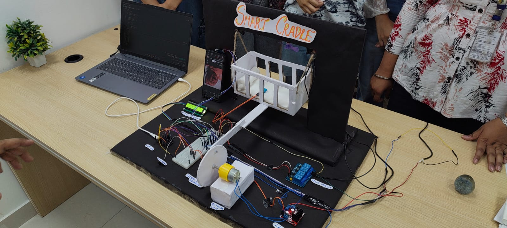
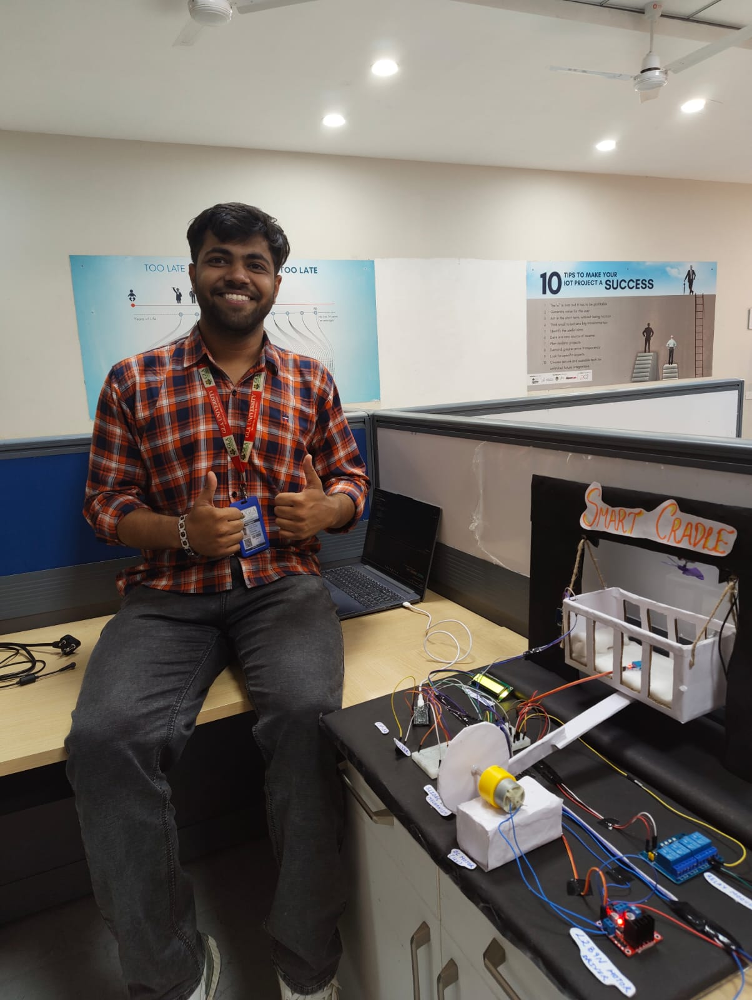

# IoT-Based Smart Cradle System 👶🛏️

An IoT-enabled Smart Baby Cradle System built using **ESP32**, sensors, and embedded automation to assist parents in monitoring and soothing babies automatically.

This project was developed as a **4th Semester IoT Field Project** at **GLA University, Mathura**.

---

# 📌 Overview

The Smart Cradle System is designed to automate baby monitoring using IoT concepts and embedded systems.

The system can:

- Detect baby crying using a sound sensor
- Automatically swing the cradle
- Monitor temperature and humidity
- Turn ON a cooling fan automatically
- Trigger alerts using a buzzer
- Display real-time status on LCD

This prototype demonstrates how IoT can be applied to real-life childcare and automation systems.

---

# 🚀 Features

✅ Cry Detection System  
✅ Automatic Cradle Swing  
✅ Temperature Monitoring  
✅ Automatic Fan Control  
✅ Humidity Detection  
✅ Buzzer Alert System  
✅ LCD Live Monitoring  
✅ ESP32-based Automation  

---

# 🛠️ Components Used

- ESP32 Microcontroller
- DHT11 Sensor
- Sound Sensor
- Relay Module
- DC Motor
- L298N Motor Driver
- LCD I2C Display
- Buzzer
- Breadboard & Jumper Wires

---

# ⚙️ Working Principle

## 🔊 Cry Detection
The sound sensor continuously monitors sound levels.

When sound exceeds the threshold:
- ESP32 detects crying
- Motor activates
- Cradle starts swinging automatically

---

## 🌡️ Temperature Monitoring
The DHT11 sensor monitors temperature continuously.

If temperature becomes high:
- Relay activates
- Cooling fan turns ON automatically

---

## 💧 Humidity Monitoring
Humidity values are continuously monitored.

If humidity crosses the threshold:
- Buzzer alert activates
- LCD displays warning message

---

## 📟 LCD Monitoring
The LCD displays real-time system status such as:

- MONITORING
- FAN ON
- CRY MOTOR ON
- FAN + CRY ACTIVE

---

# 🧠 Technologies Used

- Embedded C/C++
- Arduino IDE
- ESP32
- IoT Concepts
- Sensor Integration
- Automation Systems

---

# 📷 Project Images

## 🔹 Prototype Demonstration



---

## 🔹 Hardware Setup



---

# 🎥 Project Demonstration Video

🔗 **Video Explanation & Prototype Demonstration:**  

https://www.linkedin.com/posts/yash-upadhyay-a23491326_heres-a-quick-walkthrough-of-our-iot-based-ugcPost-7457118015705231361-i7dE?utm_source=share&utm_medium=member_desktop&rcm=ACoAAFJL9XsBwGK-CF5UpRQNf6Fz2qoehhFEAW4

The video demonstrates:
- Complete hardware setup
- Sensor integration
- Cradle movement
- Fan automation
- Real-time monitoring
- Prototype explanation

---

# 📂 Project Structure

```bash
Smart-Cradle-System/
│
├── images/
│   ├── image1.jpeg
│   └── image2.jpeg
│
├── smart_cradle.ino
├── README.md